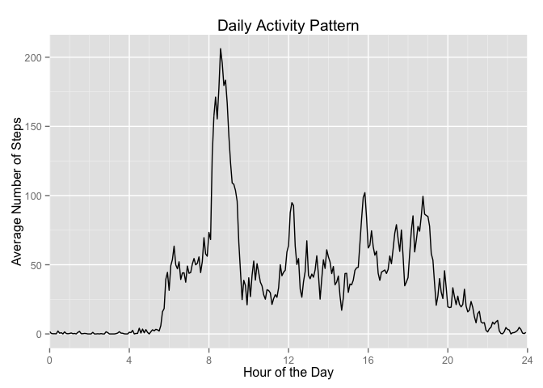
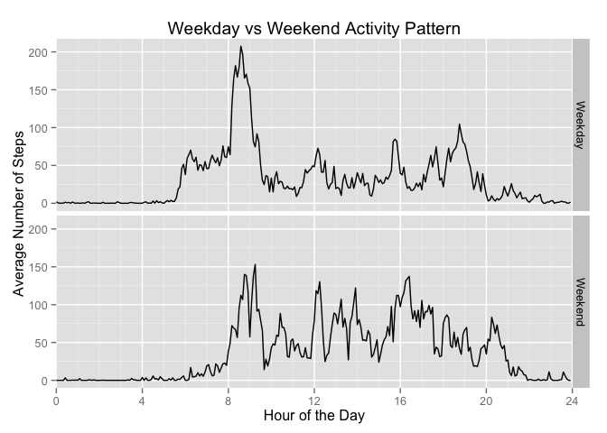

# Reproducible Research: Peer Assessment 1

## Imports


```r
library(data.table)
library(dplyr)
```

```
## 
## Attaching package: 'dplyr'
## 
## The following object is masked from 'package:data.table':
## 
##     last
## 
## The following objects are masked from 'package:stats':
## 
##     filter, lag
## 
## The following objects are masked from 'package:base':
## 
##     intersect, setdiff, setequal, union
```

```r
library(lubridate)
```

```
## 
## Attaching package: 'lubridate'
## 
## The following objects are masked from 'package:data.table':
## 
##     hour, mday, month, quarter, wday, week, yday, year
```

```r
library(zoo)
```

```
## 
## Attaching package: 'zoo'
## 
## The following objects are masked from 'package:base':
## 
##     as.Date, as.Date.numeric
```

```r
library(ggplot2)
```

## Loading and preprocessing the data


```r
if(!file.exists("activity.csv")) {
    if(file.exists("activity.zip")) {
        unzip("activity.zip")
    } else {
        stop("Cannot find data file")
    }
}
decodeTimeIdentifier <- function(timeIdentifier) {
    mnts <- timeIdentifier %% 100
    hrs <- (timeIdentifier - mnts) / 100
    hrs + mnts / 60
}
stepsData <- fread("activity.csv")    
stepsData <- mutate(stepsData,
                    date = ymd(date), 
                    hour = decodeTimeIdentifier(interval),
                    timeStamp = date + hour * 3600
                    )  %>% setkey(timeStamp)
```


## What is mean total number of steps taken per day?

A histogram of the total number of steps per day is as follows:


```r
dailySteps <- stepsData %>% group_by(date) %>% summarize(steps = sum(steps,na.rm=TRUE))
hist(dailySteps$steps,main="Daily Steps",xlab="Total steps every day")
```

 

The following is the mean total number of steps taken per day:


```r
meanDailySteps <- mean(dailySteps$steps)
round(meanDailySteps)
```

```
## [1] 9354
```

The following is the median total number of steps taken per day:


```r
medianDailySteps <- median(dailySteps$steps)
medianDailySteps
```

```
## [1] 10395
```


## What is the average daily activity pattern?

The following plot shows the average activities per five-minute intervals of all days in the data set.


```r
activityPattern <- stepsData %>% group_by(hour) %>% summarize(steps = mean(steps,na.rm=TRUE))
ggplot(activityPattern) + 
    aes(hour,steps) + 
    geom_line() +
    scale_x_continuous(breaks=seq(0,24,4),minor_breaks=0:24) +
    coord_cartesian(xlim=c(0,24)) +
    ylab("Average Number of Steps") + xlab("Hour of the Day") + 
    ggtitle("Daily Activity Pattern") 
```

 

The five-minute interval with the most average number of steps is:


```r
mostSteps <- activityPattern %>% filter(steps == max(steps)) %>% 
    mutate(Steps = round(steps),
           Time=sprintf("%02d:%02d",as.integer(hour),as.integer(abs(hour-as.integer(hour))*60))
           ) %>% 
    select(Time,Steps)
t(mostSteps)
```

```
##       [,1]   
## Time  "08:35"
## Steps "206"
```

## Imputing missing values

The number of records with missing values are:


```r
stepsData %>% filter(is.na(steps)) %>% nrow()
```

```
## [1] 2304
```

We'll use the *carry-forward* method of filling missing values. The five-minute interval with `NA` steps value will use the value of the interval that came before it. Furthermore we'll remove the first day reading of the data set since that entire day consists of all `NA` values and we assume that data collection hasn't yet started that day.


```r
stepsDataImputed <- filter(stepsData,date != ymd("2012-10-01"))  %>% mutate(steps = na.locf(steps))
```

A histogram of total steps every day after imputing data:


```r
dailyStepsImputed <- stepsDataImputed %>% group_by(date) %>% summarize(steps = sum(steps,na.rm=TRUE))
hist(dailyStepsImputed$steps,main="Daily Steps (imputed)",xlab="Total steps every day")
```

 

The following is the mean total number of steps taken per day from the imputed data:


```r
meanDailyStepsImputed <- mean(dailyStepsImputed$steps)
round(meanDailyStepsImputed)
```

```
## [1] 9510
```

The following is the median total number of steps taken per day from the imputed data:


```r
medianDailyStepsImputed <- median(dailyStepsImputed$steps)
medianDailyStepsImputed
```

```
## [1] 10417
```

Apparently imputing values introduces a small difference of the data characteristics, but the difference is not significant (about one percent).


```r
data.frame(
    Original=c(round(meanDailySteps),medianDailySteps),
    Imputed=c(round(meanDailyStepsImputed),medianDailyStepsImputed),
    Difference=c(
        sprintf("%0.2f%%",abs(meanDailyStepsImputed-meanDailySteps)/meanDailySteps*100),
        sprintf("%0.2f%%",abs(medianDailyStepsImputed-medianDailySteps)/medianDailySteps*100)
        ),
    row.names=c("Mean","Median")
    )
```

```
##        Original Imputed Difference
## Mean       9354    9510      1.67%
## Median    10395   10417      0.21%
```


## Are there differences in activity patterns between weekdays and weekends?


```r
activityPatternByDayType <- stepsDataImputed %>% 
    mutate(dayType=ifelse(weekdays(date) %in% c("Saturday","Sunday"),"Weekend","Weekday")) %>% 
    group_by(dayType,hour) %>% summarize(steps = mean(steps,na.rm=TRUE))
ggplot(activityPatternByDayType) + 
    aes(hour,steps) + 
    geom_line() +
    scale_x_continuous(breaks=seq(0,24,4),minor_breaks=0:24) +
    coord_cartesian(xlim=c(0,24)) +
    ylab("Average Number of Steps") + xlab("Hour of the Day") + 
    ggtitle("Weekday vs Weekend Activity Pattern") +
    facet_grid(dayType ~ .)
```

 

